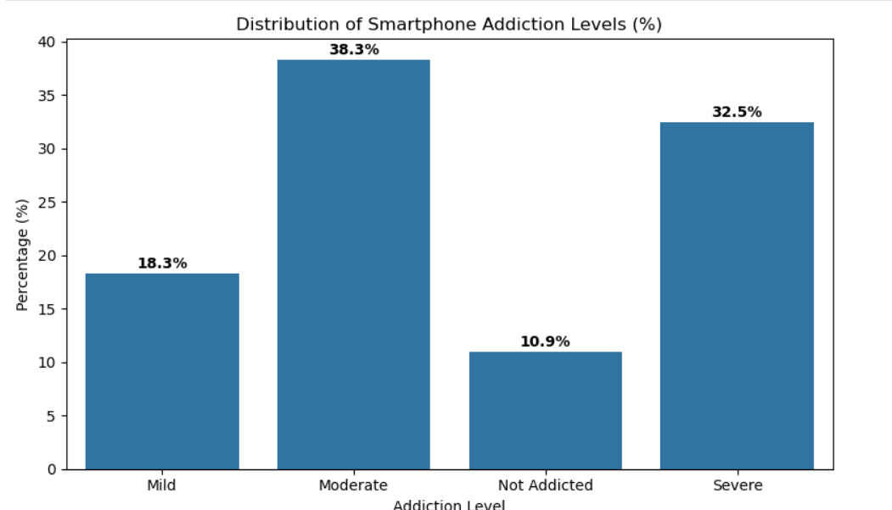
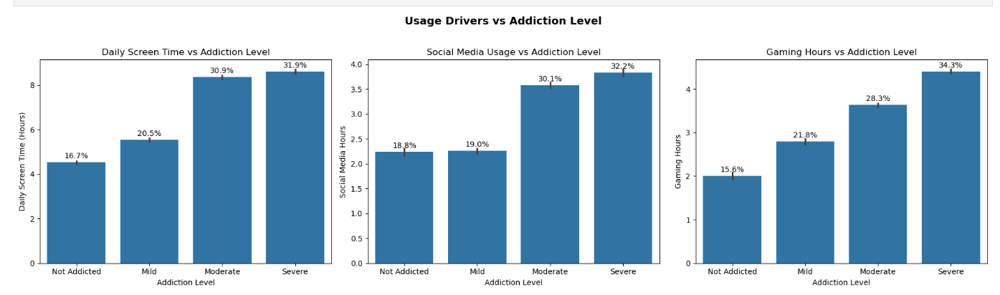
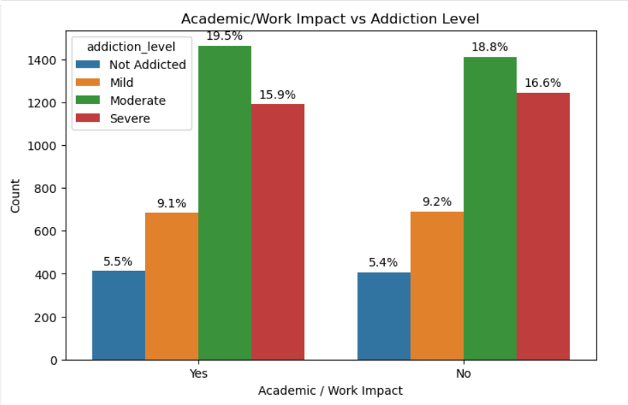

# 📱 Smartphone Addiction Analysis

---

### 📌 Project Overview

An end-to-end **Exploratory Data Analysis (EDA)** project built using **Python, Pandas, NumPy, Matplotlib, and Seaborn** to analyze smartphone usage patterns and identify the key behavioral factors associated with smartphone addiction.

The project investigates how screen time, social media usage, gaming habits, sleep patterns, stress levels, and academic performance relate to addiction severity.

---

# 🎯 Business Problem

Smartphone addiction has become a growing concern due to its impact on productivity, mental well-being, sleep quality, and academic performance.

The objective of this project is to identify behavioral indicators of smartphone addiction and generate actionable insights through data analysis and visualization.

---

# 📂 Dataset Information

The dataset contains information on:

* 👥 Age Group
* 🚻 Gender
* 📱 Daily Screen Time
* 🌐 Social Media Usage
* 🎮 Gaming Hours
* 📅 Weekend Screen Time
* 😴 Sleep Hours
* 🔔 Notifications Per Day
* 😟 Stress Level
* 📚 Academic Performance Impact
* 📈 Addiction Level

---

# 🛠️ Tools & Technologies

| Tool                | Purpose                   |
| ------------------- | ------------------------- |
| 🐍 Python           | Data Analysis             |
| 🐼 Pandas           | Data Manipulation         |
| 🔢 NumPy            | Numerical Computing       |
| 📊 Matplotlib       | Data Visualization        |
| 📉 Seaborn          | Statistical Visualization |
| 📓 Jupyter Notebook | Development Environment   |

---

# 🚀 Project Workflow

```text
Data Collection
       ↓
Data Cleaning
       ↓
Data Validation
       ↓
Exploratory Data Analysis
       ↓
Data Visualization
       ↓
Business Insights
       ↓
Recommendations
```

---

# 📊 Analysis Performed

### 📌 Univariate Analysis

* Addiction Level Distribution

### 📌 Demographic Analysis

* Age Group vs Addiction Level
* Gender vs Addiction Level

### 📌 Usage Drivers Analysis

* Daily Screen Time vs Addiction Level
* Social Media Usage vs Addiction Level
* Gaming Hours vs Addiction Level

### 📌 Lifestyle & Well-being Analysis

* Sleep Hours vs Addiction Level
* Stress Level vs Addiction Level

### 📌 Impact Analysis

* Academic Performance Impact vs Addiction Level

### 📌 Comparative Analysis

* Addicted vs Non-Addicted Users

### 📌 Correlation Analysis

* Correlation Heatmap

---

# 📸 Key Visualizations

## 📊 Addiction Level Distribution



## 📱 Usage Drivers Analysis



## 😴 Sleep & Stress Analysis


## 📚 Academic Performance Impact



## 🔥 Correlation Heatmap


# 🔍 Key Findings

### 📱 Daily Screen Time

* Screen time increases consistently as addiction severity rises.
* Severely addicted users spend nearly twice as much time on their phones compared to non-addicted users.

### 🌐 Social Media Usage

* Social media engagement increases significantly among moderate and severe addiction groups.
* Higher social media usage is strongly associated with addiction severity.

### 🎮 Gaming Hours

* Gaming time rises steadily across addiction levels.
* Severe users spend substantially more time gaming than non-addicted users.

### 😴 Sleep & Well-being

* Higher addiction levels are associated with lower sleep duration.
* Smartphone addiction negatively impacts overall well-being.

### 📚 Academic Impact

* Academic performance is adversely affected as addiction severity increases.

---

# 💡 Business Recommendations

* 📱 Encourage healthy screen-time management practices.
* 🔔 Monitor excessive smartphone usage as an early warning indicator.
* 🌐 Promote responsible social media usage.
* 🎮 Raise awareness regarding excessive gaming habits.
* 😴 Encourage digital well-being initiatives to improve sleep quality and productivity.

---

# ✅ Conclusion

The analysis reveals a strong relationship between smartphone addiction and user behavior patterns.

Daily screen time, social media engagement, and gaming activity emerge as the most influential factors associated with addiction severity. Additionally, increased addiction levels are linked to reduced sleep quality and negative academic outcomes.

These insights can help educators, parents, and digital wellness platforms develop strategies to promote healthier smartphone usage habits.

---

# 🔮 Future Enhancements

* 🤖 Build a Machine Learning model to predict addiction levels.
* 📊 Develop an interactive Power BI dashboard.
* 🎯 Perform user segmentation using clustering techniques.
* 📈 Create predictive behavioral analytics models.

---

# 👨‍💻 Author

**Aditya Thatha**

Aspiring Data Analyst | Python | SQL | Power BI | Data Visualization

📫 Connect with me on LinkedIn and GitHub.


